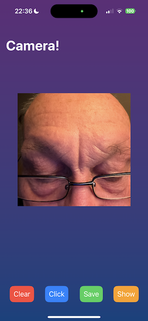
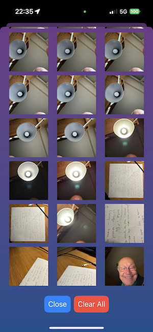

# Demo of struct FileBackedDictionary

The `FileBackedDictionary` is defined in the SPM package [RudifaUtilPkg](https://github.com/rudifa/RudifaUtilPkg) by [@rudifa](https://github.com/rudifa).

This project started as a SwiftUI app demonstrating how `FileBackedDictionary` is used to persist data between app stops and restarts.

It has been extended to learn how to capture photos with the iPhone camera and manage image view sizes and positions the SwiftUI way.

The app allows you to take photos with the camera and store them in an album.

The album is persisted in a file and reloaded when the app is restarted.

Here is a preview of the app:

    
    

